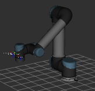
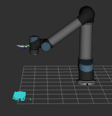
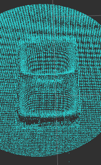
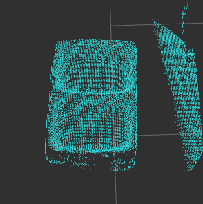
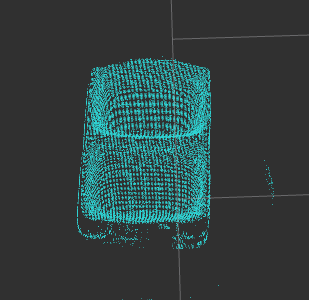
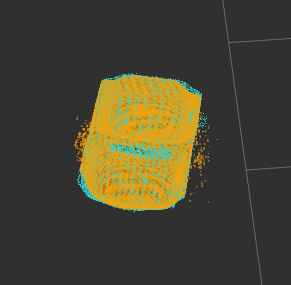

##  VT導入チェックシート
VisualTeachingシステムをご使用の際は、以下の手順をご理解の上、操作をおねがいます。

### 1.準備

<table style="font-size:1.0em;">
<tr><td width="20%"><td>1.dashboard.yamlの編集 使用するロボットやカメラに合った、設定ファイル(rc.d/以下のファイル)を選びます。パラメータ名はconfig&rarr;dashboard&rarr;load:
<tr><td><td>2.設定ファイルの編集 1で設定したファイルの中の、ロボットのIPアドレスを実際の環境に合わせて設定します。パラメータ名はlaunch_rsock&rarr;args&rarr;address:
<tr><td><td>3.ロボットプログラムの準備 最初は各社ロボット用のサンプルプログラムを読み込みます。各社ロボット用のサンプルプログラムは?????からダウンロードできます。
<tr><td><table bgcolor="#00AAFF"><tr><td style="background-color:#444444;color:#FF7700;">YCAM</table><td>4.VT起動 起動アイコンまたはコンソールからVTを起動します。ダッシュバー右のYCAMインジケータが点灯すると起動完了です。<a>トラブルシュートはこちら</a>
<tr><td><td>5.ロボット接続確認① ビューワ上のロボットの3Dモデルの姿勢が実際のロボットと一致していることを確認します。<a>トラブルシュートはこちら</a>
<tr><td><table bgcolor="#00AAFF"><tr><td style="background-color:#444444;color:#FF7700;">通信</table><td>6.ロボット接続確認② TBから「撮像コマンド」を発行します。ダッシュバー右の通信インジケータが点灯すると同時に、YCAMのプロジェクタが発光します。<a>トラブルシュートはこちら</a>
<tr><td><table bgcolor="#00AAFF"><tr><td style="background-color:#444444;color:#000000;">セットアップ</table><td>7.セットアップパネルを開く セットアップパネルはVTの様々な設定を行うパネルです。ダッシュバーの「セットアップ」右の起動ボタンで起動します。パネルは最前に配置されるため、これを開いているうちは他の操作はできません。パネルが閉じるには、ダッシュバーの「セットアップ」右の停止ボタンを押します。
</table>

### 2.キャリブレーション

### 3.ビジョンの教示
<table style="font-size:1.0em;">
<tr><td width="20%"><td>1.マスターワークの撮像 マスターとする教示を行うためワークを配置します。この対象物体を撮影できる位置にロボットを移動します。TBから撮像コマンドを与えるか、セットアップパネルの「3Dスキャン」ボタンを押します。得られたデータとロボットの相互位置関係が実際と一致していることを確認します。
<tr><td><td>2.撮像調整 ノイズができるだけ小さく、また対象の凹凸などが鮮明に捉えられるように、セットアップパネルにてカメラ調整、およびロボットを移動して撮影位置を調整します。<a>カメラ調整はこちら</a>
<tr><td><td>3.撮像データの加工① 撮像データからワークの余計なデータを取り除きます。これにはセットアップパネルの3.クロップ を用います。「Zクロップ」は設定距離より遠方のデータを取り除く機能です。これによって床などを取り除きます。またZクロップ機能を簡単に使うために、対象物体の下に嵩上げのための台を置くなどもよいアイデアです。
<tr><td><td>4.撮像データの加工② 「Rクロップ」は画像中心から設定半径以上のデータを取り除く機能です。これによって周囲の壁などを取り除きます。
<tr><td><td>5.撮像データの加工③ 「すくい取り」機能は鉛直上方から設定データ数をすくい取るものです。これは主にプレイバック時に積まれたワークを上方から取り出すときに用います。
<tr><td><table bgcolor="#CCCCCC" style="font-size:0.8em;"><tr><td style="background-color:#444444;color:#FFFFFF;">4.マスター管理<tr><td align="right">マスター登録</table><td>7.マスター登録 セットアップパネルの4.マスター管理「マスター登録」ボタンにて加工したデータが保存されます。
</table>

### 4.ロボットの教示
<table style="font-size:1.0em;">
<tr><td width="20%"><td>1.把持経路の教示 各社ロボットの操作方法に従い、対象物体に対する把持経路などを教示します。サンプルプログラムでは「ハジ」または「glasp」という名前にて、この教示点を予めプログラムしていますので、これおよび前後の経由点に実際の位置を教示します。このとき以下の注意点を厳守してください。
<ol>
<li>マスターワークを動かさない
<li>ベース座標系にて教示する
</ol>
<tr><td><td>2.教示のやり直し 教示時にマスターワークを動かしてしまった場合は、ビジョンの教示をやり直してください。このとき次の手順による作業が効率的です。
<ol>
<li>先に把持経路を教示を済ませる
<li>ワークを把持した状態から逆ステップにて把持位置に移動させ、静かに放す
<li>この状態にてビジョンの教示を行う
<tr><td><td>3.撮影点の教示 プレイバック時の対象ワーク配置位置にワークを設置し、プレイバック時に撮影点を教示します。サンプルプログラムでは「キャプチャ0」または「capture0」という名前にて、この教示点を予めプログラムしていますので、これに実際の撮像位置を教示します。
<tr><td><td>4.試し撮り 3の位置にてTBから「撮像コマンド」を送るか、セットアップパネルの「3Dスキャン」ボタンを押して、撮像します。次に「解析コマンド」またはパネルの5.解析エンジン「解析」ボタンを押して、ワーク認識の確認します。ワークの認識に成功すれば、オレンジ色の点が対象ワークに重ねられます。<a>トラブルシュートはこちら</a>
<tr><td><table bgcolor="#CCCCCC" style="font-size:0.8em;"><tr><td style="background-color:#444444;color:#FFFFFF;">6.解析チェック<tr><td align="right">一致度下限</table><td>5.誤認識防止 パネルの6.解析チェック「一致度下限」は一致度がこの設定以下の場合にエラーとすることで、誤認識を防止します。現在のスコアから適切な数値を設定します。0.9以上の値が望ましいです。
<tr><td><td>6.その他の経路の教示 その他未教示の点を教示します。以上で教示は完了。プレイバック運転を行います。
</table>

### 5.ロボットの再教示  
教示点を修正したい場合は以下のように行います。
<table style="font-size:1.0em;">
<tr><td width="20%"><td>1.ステップ実行 対象ワークを配置しステップ実行モードにて「撮像」「解析」を行います。もしワークの配置位置がプレイバックモードと異なる場合は一時的に撮影位置を移動して「撮像」しても構いません。
<tr><td><td>2.修正 修正したい教示点までステップで送り、当該点を再教示します。
</table>
