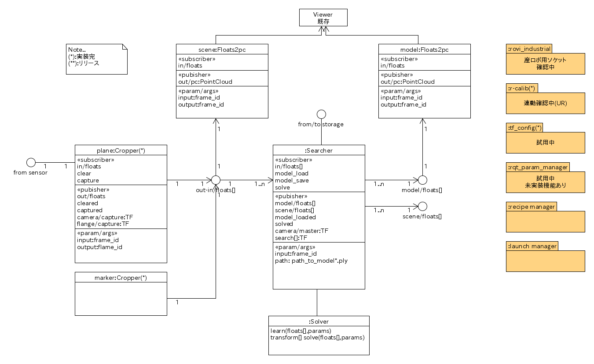

## MasterTeach

### 要件
- 範囲は、Industrial Robot I/F,Searcher,Cropperの管理と、それらのUI(rqt_param_manager)
- ３とおりの機器構成

||カメラ|対象物体|
|:----|:----|:----|
|1|ロボット|固定|
|2|固定|ロボット|
|3|固定|固定|

- 構成1,2での点群合成機能
- 構成1でのマウントポイント指定(J6,J5...)
- ソルバー選択機能

### UML

### Dependency
- RoVIコア
- RoVIユーティティ(cropper,searcher)
- Rqt_parm_manager

### Launch  
#### メイン
~~~
roslaunch rovi_master_teach main.launch
~~~
#### 段取り  
撮像調整、マスター登録など
~~~
roslaunch rovi_master_teach setup.launch
~~~
- 使用する前に、**tf_config**での装置構成設定、**r-calib**でのキャリブレーションが必要です。
- メッセージは当面(GUIが供用できるまで)は以下にてご確認ください。
~~~
rostopic echo /message
~~~
