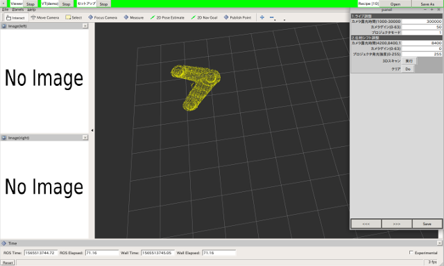

# Visual Teaching & Playback

## 準備  
以下をCheckoutしてBuildします。
- [rovi(コア)](https://github.com/YOODS/rovi)
- [rovi_utils(ユーティティ)](https://github.com/YOODS/rovi_utils)
- [rtk_tools(GUIツール)](https://github.com/YOODS/rtk_tools)

## 起動  
アプリケーションが正しく動作するには、後述の *dashboard.yamlの設定* , *recipeの設定* が必要です。しかしながら、checkoutしたままの状態でもデモモードで起動するので、必要なソフトウェアが正しくインストールされていることを確認するために、まずは以下の手順にて起動テストを行います。
1. dashboardの起動  
弊社アプリケーションのエントリーポイントは全て**start.launch**です。
~~~
roslaunch rovi_master_teach start.launch
~~~
これによって先ずdashboard(スクリーンの上端)が起動されます。

2. プログラムの起動  
プログラムはlaunch単位にて**dashboard**から起動されます。dashboardから起動されるプログラムには
  - dashboardから自動的に起動されるもの
  - Startボタンにて起動されるもの  
があります。これらはパラメータ/config/dashboard/下の設定に従います。  
起動中のプログラムは、そのラベルの背景が白(文字色は黒)、停止中のものは背景グレー(文字色は赤)にて区別されます。

## パラメータファイル構成
### 構成の設定
機器構成の違いは、どのyamlファイルをロードするかによって、決定します。dashboard.yamlの**preload**タグはdashboard起動直後にロードされるファイルを指定します。これにより、先の *プログラム起動* はこのファイルによってオーバライドされたパラメータが反映されます。以下にyamlファイルのロード順序を示します。

|分類||start.launch|dashboard起動|プログラム起動|
|:----|:----|:----|:----|
|共通設定|dashboard.yaml rcalib.yaml|-|-|
|機器毎設定|-|rc.d/*.yaml dashboard.yamlにて指定|-|
|パッケージ毎設定|-|-|*パッケージ* /*.yaml|

### recipeの設定  
recipeファイル群は *recipe.d/* 以下に保存されます。checkout直後には *recipe.d/10/* にリンクしているはずですが。リンクが破損している場合は以下のように復旧します。
~~~
ln -fs recipe.d/10/ recipe
~~~

## ドキュメントインデックス
- [要求仕様](REQUIRE.md)
- [教示方法について](Teaching.md)
- [干渉チェック機能の使い方について](CollisionChecker.md)

## スクリーンショット

