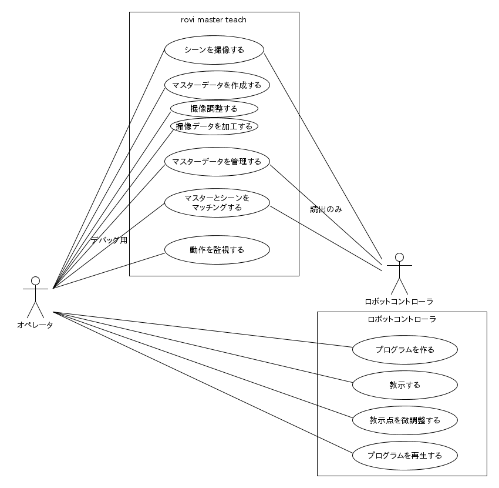
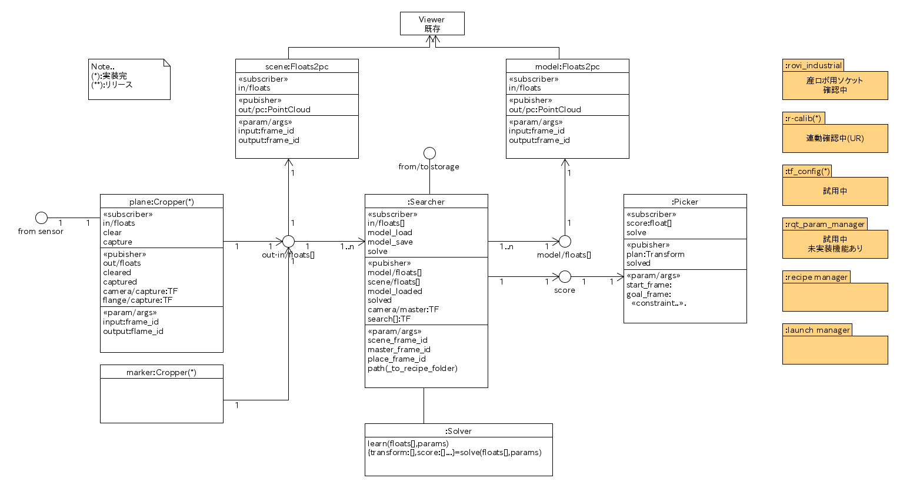

# Design sheet
## Requirement study

### ユースケース

### 要件(ユースケース補足)
- 3とおりの機器構成

||カメラ|対象物体|
|:----|:----|:----|
|1|ロボット|固定|
|2|固定|ロボット|
|3|固定|固定|

- 構成1,2での点群合成機能
- 構成1でのマウントポイント指定(J6,J5...)
- ソルバー選択機能

### オブジェクト図

