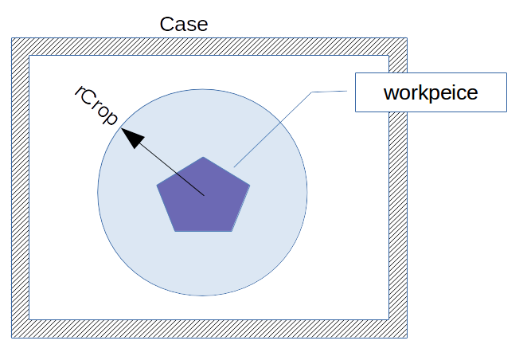
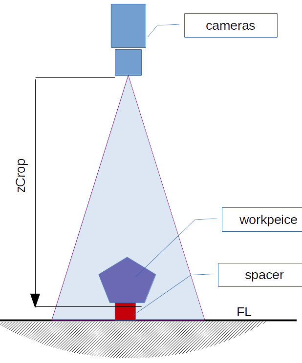
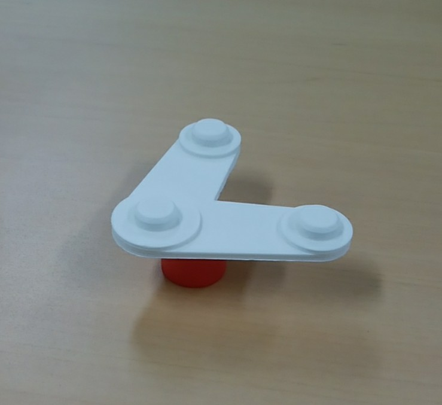
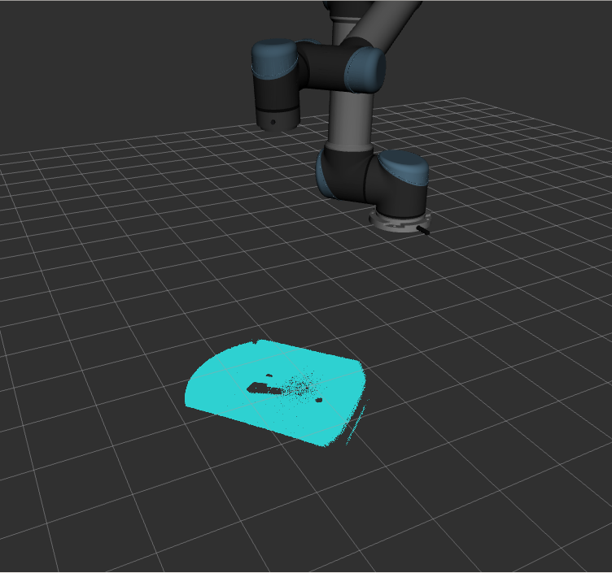
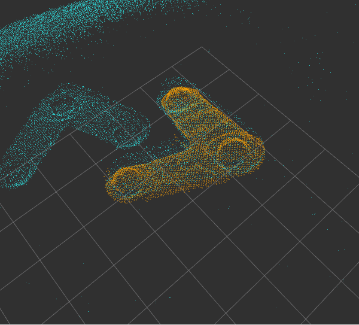
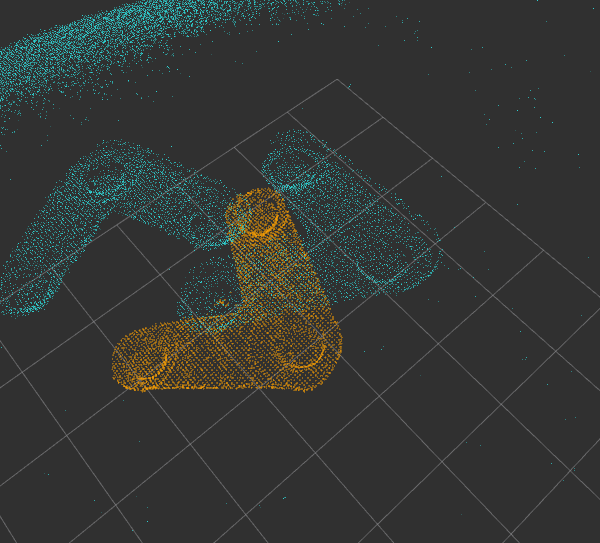

## 教示方法  
VisualTeachingシステムで教示を行う際は、以下の手順をご理解の上、ロボットの操作をおねがいます。

### 1.基準Viewの教示  
VisualTeachingではロボットの教示を行う前に、Viewの教示を行います。Viewとは、ロボットの動作が行われる**景色**を意味します。例えばピッキングであればViewはピック対象のワークであり、ネジ締めであれば組み立て対象の製品を指します。  
基準Viewとは、Viewのうち次のロボットの教示の基準とするViewを指します。  
これは、従来のロボットの教示が「手」の動作のみを教示していたのに対して、そこに「目」の教示を加えるという考え方です。この考え方は、ピッキング以外の用途にもアイデア次第で応用できる、高い汎用性を実現します。

1. クロッピング  
ロボットの動作の基準となるViewには極力余分な情報を除外したViewを教示する必要があります。このための不要な情報を除去するCropping機能について説明します。  
    - R-Cropping  
    対象の周囲のケースなどを除去するのがR-Croppingです。これは図のようにカメラの中心から一体半径以上の撮像情報を除去します。  
      
    - Z-Cropping  
    対象のファーサイドの床などを除去するのがZ-Croppingです。これは図のようにカメラから一体距離以上の撮像情報を除去します。Z-Croppingにより不要情報を除去しやすくするために、対象をスペーサ等に載せることも効果的です。  
      

2. 実例  
<table>
<tr><td>レシピの選択<td>Dashboardの「~~レシピ呼び出し~~」ボタンを押してレシピを呼び出します。新規のレシピの場合は....
<tr><td>セットアップユーテリティの呼出<td>Dashboardの「マスター登録」ボタンを押してパネルを起動します。
<tr><td>ワークの設置<td>教示対象のワークを置きます。図ではスペーサに載せて台から10mm程度浮かせています。
<tr><td>撮像位置へ移動<td>ワークがカメラ中心付近に写るよう、ロボットを操作します。対象とカメラの距離が、カメラの最大撮像距離を超えないように注意してください。
<tr><td>取り込み<td>パネルの「3Dスキャン」ボタンを押してViewを取り込みます。図ではワーク遠方の台も同時に取り込まれています。
<tr><td>撮像調整<td>きれいに取り込みが出来ないときは、撮像調整が必要です([撮像調整](https://))。再取り込みすするときは、パネルの「クリア」ボタンにて取り込んだ3Dデータを、先にクリアします。
<tr><td>Z-Crop<td>パネルのZ-Cropにて調整して不要なデータを除去します。図はZ-Crop=0.54にて台を除去した後です。
<tr><td>登録<td>パネルの「登録」ボタンにて、このデータがマスター(基準View)として登録されます。Viewerでの表示色が黄色のデータがマスターです。
</table>

### 2.ロボットの教示  
Viewの教示が終わったら、従来通りロボットの教示を行いますが、以下２点の注意点を厳守ねがいます。

> ・Viewの教示の際の対象物は動かさない  
> ・教示はベース０座標系で行う  

1. 対象物は動かさない  
Viewの教示をした後、対象を移動してロボットの教示を行ってはいけません。ただし、ピッキングの教示にて**把持点を教示した後**に、対象を把持して移動することは構いません。

2. ベース０座標系  
ベース０座標系はロボットのベースを原点とする座標系です。VisualTeachingはPlayback時にViewを基準とした新たな座標系を算出します。これに基づきロボット側はベース座標をこの座標に切り替えますが、**基準となる座標系は常にベース０**です。別の座標系で教示した場合は、衝突など危険がありますので、座標系の確認をおねがいします。

### 3.認識エンジンのテスト  
実際の運用状態でのViewから、基準Viewに一致するものを見つけるのが認識エンジンです。Playback運転を行う前に認識エンジンが正しくViewを認識できていることをテストします。

1. Viewの取得
実運用状態にて対象物を設置し、Viewを取り込みます(シーンView)。取り込みはセットアップユーティリティの「撮像」ボタンでも可能です。

2. Viewの解析
セットアップユーティリティの「解析」ボタンを押し、認識エンジンを起動します。正しく認識できれば下の右図のように、基準View(オレンジのドット)がシーンView(水色のドット)の一致する位置に重ねられます。一方、認識が上手く行かない場合は、右図のようになります。    
<table>
<tr><td><td>
</table>

3. 認識エンジンの調整

### 4.マスター登録の修正
基準View登録, ロボットの教示, 認識エンジンのテストが終わったら、実際にロボットから撮影指令→認識命令を発行してロボットを動かしてみてください[ロボットのプログラミング](https://))。実際動かしてみると思った指示位置に行かないこともあります。その原因は様々ですが、
- ロボット教示中にワークに触ってしまった。ワークが動いてしまった。
- 教示が甘かった。
等が考えられます。このような場合、基準Viewから登録し直すのは面倒なので、ロボットの教示のみ修正して対応することができます。

1. ロボットのベース0座標系でワークを撮影して認識エンジンを実行します。
2. ロボットの基準座標系をビジョン認識結果に基づいて変更します。ここではその座標系をユーザー座標系とします。
3. ユーザー座標系のまま、教示ポイントを修正して再登録してください。

これだけで、教示点の修正は完了します。

### 5.Visual TeachingのTips
- (ICPベースの認識エンジンでは)マスター登録のマスターは立体形状の特徴を捉えること
	- 3つ以上の平行でない平面を含む
		- 平行面をできるだけ含まない
		- 撮影時のカメラ姿勢はフレキシブルに考える。できるだけ複数の面を捉える。
	- 複数の方向を向いた面の面積が同じくらいの面積をもつ
		- 特定の面の面積が大きいと、その面を中心として回転, 位置決め精度が悪くなる
- (ICPベースの認識エンジンでは)一致率を閾値とする場合は、マスターはできるだけ小さくする
	- ワークの特徴を表現するのに必要ないデータは削除した方が良い
- 撮影→認識後、そのままアプローチするとケース等にぶつかるケースがある。たとえばピッキングの場合、一旦、箱中央に移動してアプローチすれば衝突を回避できることがある。
- 教示は先に「手」の教示を行い、その後、「目」の教示を実行したほうが良い。手の教示時にワークを動かす場合が多く、またそのつもりがなくてもワークが動いてしまうことがあるため。

